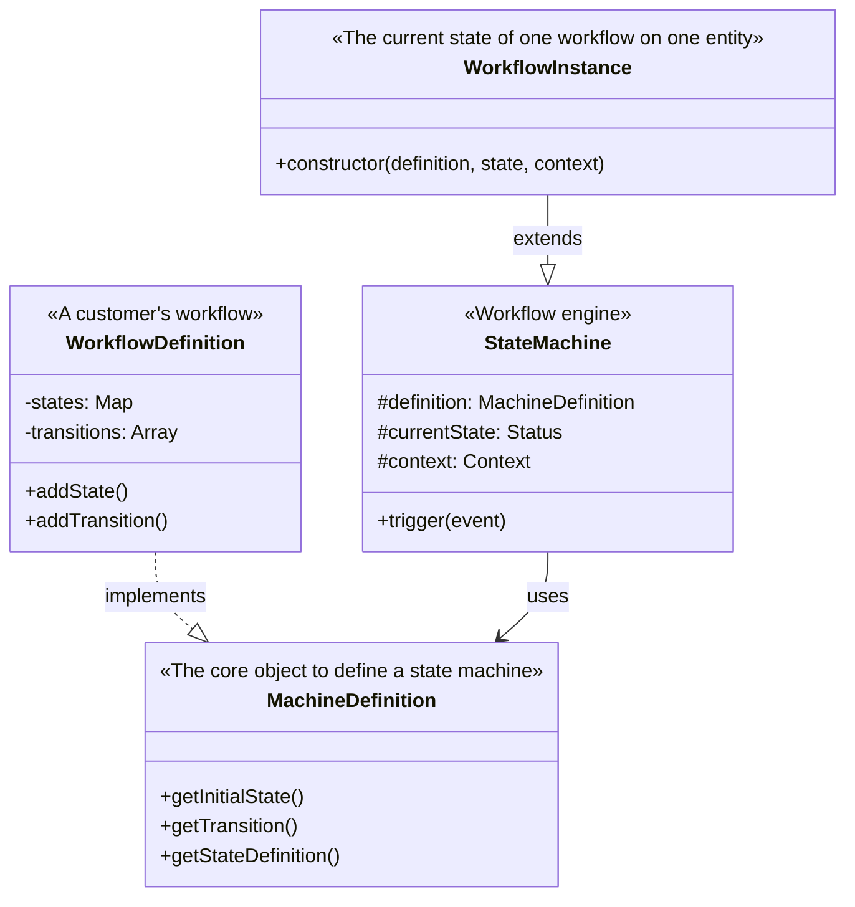
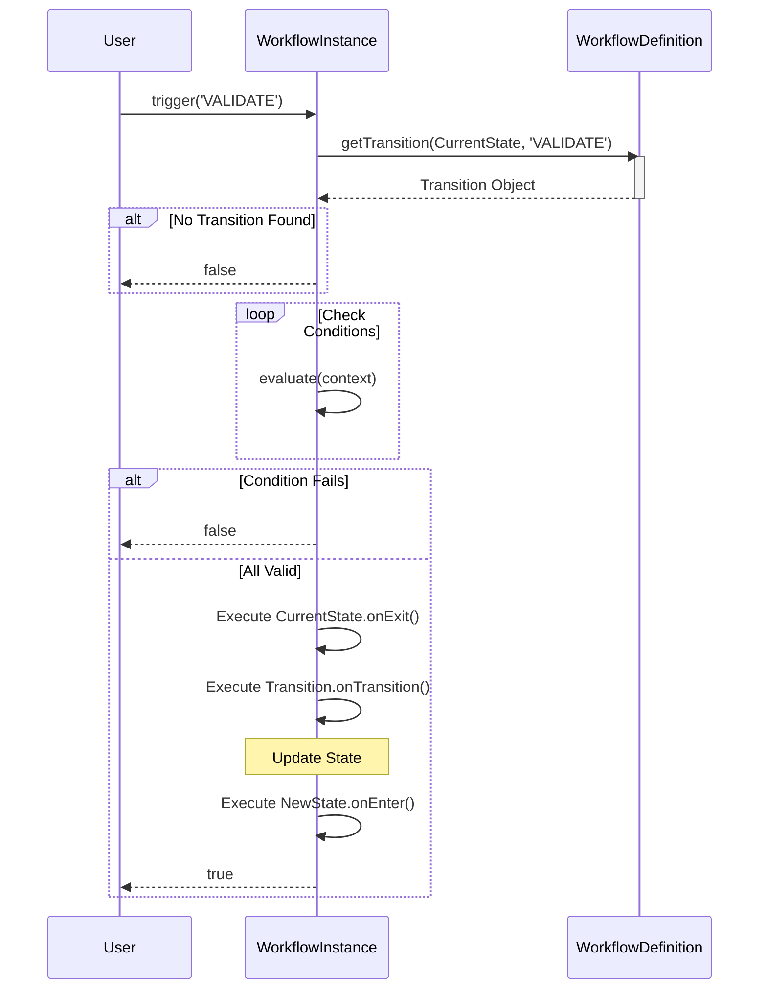

# Workflow Engine Documentation

This project includes a lightweight, flexible workflow engine based on a **State Machine** architecture. It allows you to define states, transitions, guard conditions, and side effects for any entity in your system.

## Core Concepts

1.  **StateMachine**: The generic engine that handles state transitions, events, and side effects.
2.  **WorkflowDefinition**: A builder class to easily define the structure of your workflow (states, transitions, hooks).
3.  **WorkflowInstance**: The runtime object that associates a definition with a specific data context (e.g., a "Draft" entity) and tracks its current state.

---

## How to Create a New Workflow

### 1. Define the Context

First, define the typescript interface for the data available to your workflow.

```typescript
import { Context } from '../types';
import { MyEntity } from '../../entities/MyEntity';

export interface MyEntityContext extends Context {
  entity: MyEntity;
}
```

### 2. Create the Definition

Instantiate `WorkflowDefinition` with the initial state and your context type.

```typescript
import { WorkflowDefinition } from '../WorkflowDefinition';

const myWorkflow = new WorkflowDefinition<MyEntityContext>('DRAFT');
```

### 3. Add States and Side Effects

You can define hooks that run when entering or exiting a state.

```typescript
myWorkflow
  .addState('DRAFT', {
    onEnter: [async (ctx) => console.log('Draft started')],
  })
  .addState('PUBLISHED', {
    onEnter: [async (ctx) => sendEmailToSubscribers(ctx.entity)],
  });
```

### 4. Add Transitions

Transitions connect states via **Events**. You can optional add **Conditions** (Guards) and **Transition Side Effects**.

```typescript
myWorkflow
  .addTransition('DRAFT', 'PUBLISHED', 'PUBLISH_EVENT', {
    // Both conditions must return true for the transition to happen
    conditions: [
      (ctx) => ctx.entity.isValid(),
      (ctx) => ctx.currentUser.isAdmin
    ],
    // Runs only if transition is successful
    onTransition: [(ctx) => console.log('Publishing...')]
  })
  .addTransition('PUBLISHED', 'ARCHIVED', 'ARCHIVE_EVENT');
```

---

## How to Use the Workflow

### 1. Instantiate

To use the workflow for a specific entity, create a `WorkflowInstance`.

```typescript
import { WorkflowInstance } from '../WorkflowInstance';

// Your entity from DB
const myEntity = await db.getEntity(id);

// Create the context
const context = { entity: myEntity };

// Initialize instance (State is usually stored on the entity itself)
const workflow = new WorkflowInstance(myWorkflow, myEntity.status, context);
```

### 2. Check State

```typescript
console.log(workflow.getCurrentState()); // e.g. 'DRAFT'
```

### 3. Trigger Events

To change state, trigger an event. The `trigger` method returns `true` if successful, or `false` if the transition was not found or conditions failed.

```typescript
const success = await workflow.trigger('PUBLISH_EVENT');

if (success) {
  // Update your database with the new state
  myEntity.status = workflow.getCurrentState();
  await db.save(myEntity);
} else {
  console.error("Transition failed! Check conditions.");
}
```

## Structure

- **`types.ts`**: Core type definitions (State, Event, Transition, Context).
- **`StateMachine.ts`**: The base logic for processing transitions.
- **`WorkflowDefinition.ts`**: Fluent API for constructing state machines.
- **`WorkflowInstance.ts`**: Runtime wrapper around the StateMachine for specific contexts.

## Visual Overview

### Class Relationships



### Execution Flow: `trigger(event)`


