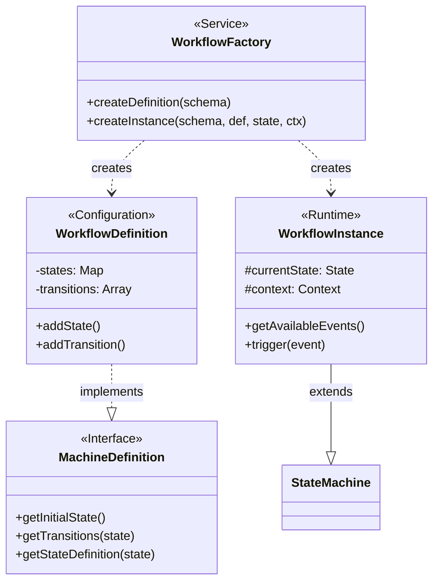
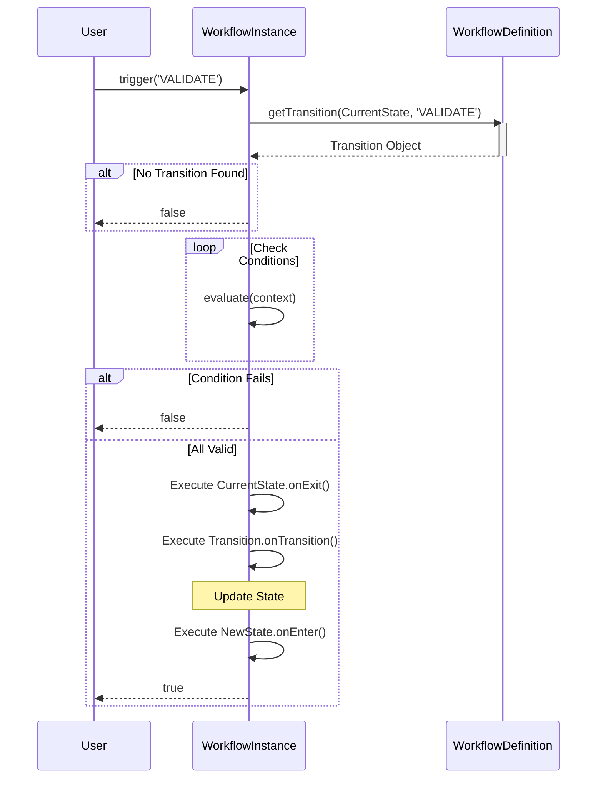

# Workflow Engine Documentation

This project includes a lightweight, flexible workflow engine based on a **State Machine** architecture. It allows you to define states, transitions, guard conditions, and side effects for any entity in your system.

## Core Concepts

1.  **StateMachine**: The base engine logic. It handles the mechanics of moving from state A to state B, executing side effects, and checking guards. It relies on a `MachineDefinition` to know the rules.
2.  **WorkflowDefinition**: The configuration object (the "Blueprint"). It explicitly defines the states, transitions, and logic hooks. It implements the `MachineDefinition` interface expected by the StateMachine.
3.  **WorkflowInstance**: The runtime implementation (the "Runner"). It **extends** `StateMachine` and binds a specific `WorkflowDefinition` to a specific data `Context` (your entity) to track its individual lifecycle.
4.  **WorkflowFactory**: The assembler. It is a helper service used to construct a `WorkflowInstance` by combining a Schema (data), a default Definition (code), and a Context (entity). It also compiles declarative rules (JSON) into executable functions.
5.  **ActionRegistry**: A catalog of available side-effect functions that can be referenced by string in your workflow schemas.

---

## How to Create and Use Workflows

### 1. Define the Context

First, define the typescript interface for the data available to your workflow.

```typescript
import { Context } from '../types';
import { MyEntity } from '../../entities/MyEntity';

export interface MyEntityContext extends Context {
  entity: MyEntity;
}
```

### 2. Create a Definition (Code-First)

Instantiate `WorkflowDefinition` with the initial state.

```typescript
import { WorkflowDefinition } from '../WorkflowDefinition';

export const myEntityWorkflow = new WorkflowDefinition<MyEntityContext>('DRAFT');

myEntityWorkflow
  .addState('DRAFT', {
    onEnter: [async (ctx) => console.log('Draft started')],
  })
  .addState('PUBLISHED', {
    onEnter: [async (ctx) => sendEmailToSubscribers(ctx.entity)],
  })
  .addTransition('DRAFT', 'PUBLISHED', 'PUBLISH_EVENT', {
    conditions: [(ctx) => ctx.entity.isValid()],
  });
```

### 3. Instantiate using the Factory (Recommended)

The `WorkflowFactory` allows you to create instances in a generic way, handling both hardcoded logic and dynamic schemas from your database.

```typescript
import { WorkflowFactory } from '../WorkflowFactory';

// 1. Prepare your data
const myEntity = await db.getEntity(id);
const context: MyEntityContext = { entity: myEntity };

// 2. (Optional) Fetch a dynamic schema if your entity uses one
const schema = myEntity.workflowId ? await db.getSchema(myEntity.workflowId) : undefined;

// 3. Create the instance
// - If 'schema' is provided, it takes precedence.
// - Otherwise, 'myEntityWorkflow' (default) is used.
const workflow = WorkflowFactory.createInstance<MyEntityContext>(
  schema, 
  myEntityWorkflow, 
  myEntity.status, 
  context
);
```

### 4. Interact with the Workflow

#### Check State

```typescript
console.log(workflow.getCurrentState()); // e.g. 'DRAFT'
```

#### Get Available Actions (Dynamic UI)

You can query the workflow to see what events are valid for the current state. This is useful for rendering buttons in your frontend.

```typescript
const allowedEvents = workflow.getAvailableEvents();
// Result: ['PUBLISH_EVENT', 'DELETE_EVENT']
```

#### Trigger Events

To change state, trigger an event. The `trigger` method returns `true` if successful.

```typescript
const success = await workflow.trigger('PUBLISH_EVENT');

if (success) {
  // Update your database with the new state
  myEntity.status = workflow.getCurrentState();
  await db.save(myEntity);
  
  // You might also want to send the new allowed events to the UI
  const newActions = workflow.getAvailableEvents();
} else {
  console.error("Transition failed! Check conditions.");
}
```

## Advanced Features: Declarative Logic

The engine supports defining logic in JSON format (via `WorkflowSchema`), allowing for "No-Code" workflow building.

### 1. Registering Actions

To allow the JSON schema to trigger code, you must register functions in the `ActionRegistry`.

```typescript
// server/src/workflow/ActionRegistry.ts
export const ActionRegistry = {
  // Sync action (awaits completion)
  logActivity: async (ctx, params) => {
    await db.logs.create({ msg: params.message, entity: ctx.entity.id });
  },
  
  // Async action (fire-and-forget)
  sendEmail: async (ctx, params) => {
    await mailer.send(ctx.entity.email, params.template);
  }
};
```

### 2. Using Actions in Schema

In your JSON schema (or Builder UI), you can reference these actions in `onEnter`, `onExit`, or `transitions`.

```json
"onEnter": [
  {
    "type": "sendEmail",
    "mode": "async", 
    "params": { "template": "welcome_email" }
  }
]
```

*   **Sync Mode**: The workflow waits for the action to finish. If it fails, the transition might abort (depending on implementation).
*   **Async Mode**: The workflow triggers the action in the background and continues immediately.

### 3. Declarative Conditions (Guards)

Instead of writing code functions, you can define transition rules using JSON. The `WorkflowFactory` compiles these into validation functions.

```json
"conditions": [
  {
    "field": "entity.amount",
    "operator": "gt",
    "value": 1000
  },
  {
    "field": "user.role",
    "operator": "eq",
    "value": "MANAGER"
  }
]
```

Supported operators: `eq`, `neq`, `gt`, `gte`, `lt`, `lte`, `contains`.

---

## Structure

- **`types.ts`**: Core type definitions (State, Event, Transition, Context).
- **`StateMachine.ts`**: The base logic for processing transitions.
- **`WorkflowDefinition.ts`**: Fluent API for constructing state machines.
- **`WorkflowInstance.ts`**: Runtime wrapper around the StateMachine for specific contexts.
- **`WorkflowFactory.ts`**: Generic factory for instantiating workflows.
- **`ActionRegistry.ts`**: Central registry for available side-effect functions.

## Visual Overview

### Class Relationships



### Execution Flow: `trigger(event)`


